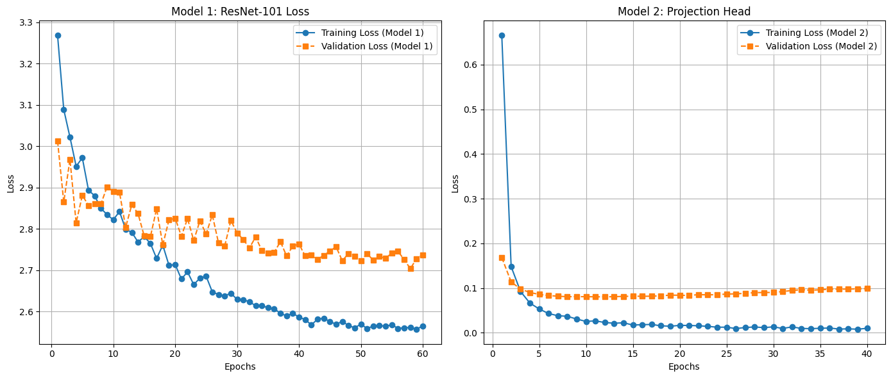
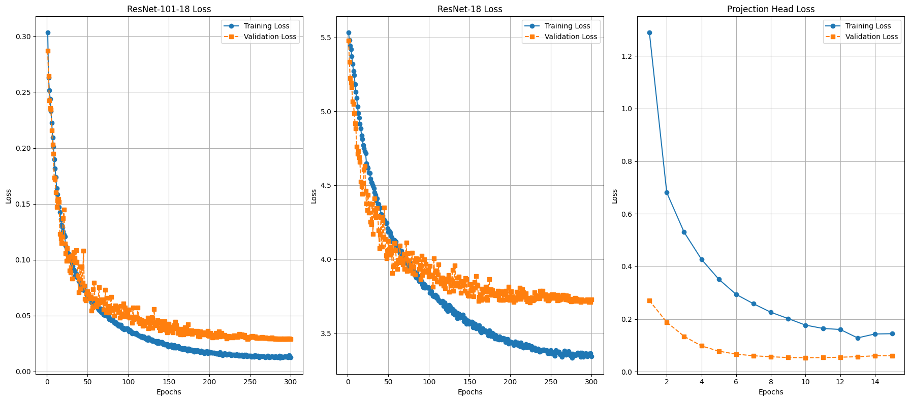

# ConKD-Lion: Contrastive Knowledge Distillation with Logit Standardization and Lion Optimizer

## Overview
This project implements an approach to **Knowledge Distillation (KD)** by mixing:
- **Contrastive Learning Loss**: Enhances alignment between teacher and student representations.
- **Logit Standardization**: Normalizes logits for improved training stability and performance.
- **Lion Optimizer**: A memory-efficient, fast optimizer for large-scale machine learning tasks.

The framework aims to improve the transfer of knowledge from a **ResNet-101 teacher model** to a **ResNet-18 student model**, achieving high performance on the **Imagenette dataset** with reduced complexity.

---

## Features
- **Knowledge Distillation**: Transfers knowledge from a larger pre-trained teacher model (ResNet-101) to a smaller student model (ResNet-18).
- **Contrastive Supervised Loss**: Ensures alignment of student predictions with real ground truth labels.
- **Logit Standardization Loss**: Derived from the CVPR 2024 paper *Logit Standardization in Knowledge Distillation*, this loss stabilizes training by normalizing logits.
- **Lion Optimizer**: Speeds up convergence and improves generalization.

---

## Dataset
This project utilizes the **Imagenette dataset**, a subset of ImageNet, designed for efficient training and experimentation. Imagenette includes 10 classes of images with the same high-quality annotations as ImageNet.

- **Dataset Link**: [Imagenette on GitHub](https://github.com/fastai/imagenette)
- **Why Imagenette?**
  - Smaller and faster to train than the full ImageNet dataset.
  - Ideal for benchmarking lightweight models and training methods.

---

## Methodology

### Teacher and Student Models
This project uses pre-trained ResNet models:
- **Teacher Model**: ResNet-101, a deep and expressive model.
- **Student Model**: ResNet-18, a smaller and efficient architecture.

### Logit Standardization Loss
The **Logit Standardization Loss** aligns the outputs of the teacher and student models using normalization and temperature scaling. It is defined as:
```python
class LogitStandardizationLoss(nn.Module):
    def __init__(self):
        super(LogitStandardizationLoss, self).__init__()

    def forward(self, logits_teacher_in, logits_student_in, temperature=2):
        logits_student = normalize1(logits_student_in) 
        logits_teacher = normalize1(logits_teacher_in)
        log_pred_student = F.log_softmax(logits_student / temperature, dim=1)
        pred_teacher = F.softmax(logits_teacher / temperature, dim=1)
        loss_kd = F.kl_div(log_pred_student, pred_teacher, reduction="none").sum(1).mean()
        loss_kd *= temperature**2
        return loss_kd
```

### Contrastive Learning Loss
A **contrastive supervised loss**, adapted from the [SupContrast repository](https://github.com/HobbitLong/SupContrast/tree/master), aligns the real labels and predicted labels of the student model:
```python
class SupContrastiveLoss(nn.Module):
    def __init__(self, temperature=0.07):
        super(SupContrastiveLoss, self).__init__()
        self.temperature = temperature

    def forward(self, features, labels):
        device = features.device
        labels = labels.contiguous().view(-1, 1)
        mask = torch.eq(labels, labels.T).float().to(device)

        features = F.normalize(features, dim=1)
        similarity_matrix = torch.matmul(features, features.T) / self.temperature

        logits_max, _ = torch.max(similarity_matrix, dim=1, keepdim=True)
        logits = similarity_matrix - logits_max.detach()
        exp_logits = torch.exp(logits) * (1 - torch.eye(features.size(0)).to(device))

        log_prob = logits - torch.log(exp_logits.sum(1, keepdim=True))

        mean_log_prob_pos = (mask * log_prob).sum(1) / mask.sum(1)

        loss = -mean_log_prob_pos.mean()
        return loss
```

### Combined Loss Function
The final loss combines the **Logit Standardization Loss** and **Contrastive Supervised Loss**:
```python
total_loss = kd_loss + alpha * contrastive_loss
```
Where:
- `kd_loss`: Logit Standardization Loss.
- `contrastive_loss`: Contrastive Supervised Loss.
- `alpha`: A weighting factor to balance the two losses.

### Training Process
1. **Teacher Model**:
   - Pre-trained ResNet-101 generates the logits and feature embeddings.
2. **Student Model**:
   - ResNet-18 learns using the combined loss, supervised by the teacher and ground truth labels.

---

## Installation
Clone the repository and install dependencies:
```bash
git clone https://github.com/pariyajebreili/ConKD-Lion.git
cd ConKD-Lion
```

---
## Usage

1. **Prepare the Dataset**:
   Download and preprocess the Imagenette dataset using the scripts provided in the repository.

2. **Train the Teacher Model**:
   Use the notebook `resnet101-teacher.ipynb` to train a ResNet-101 model as the teacher.

3. **Run Knowledge Distillation**:
   Use the notebook `resnet101-18-teacher-student.ipynb` to train the student model (ResNet-18) using the pre-trained ResNet-101 teacher.


4. **Evaluate the Student Model**:
   Evaluate the trained ResNet-18 student model.

5. **Run Additional Experiments**:
   Use the provided notebooks as templates to experiment with other model architectures, loss functions, or optimizers.

---

## Resources
- **Dataset**: [Imagenette on GitHub](https://github.com/fastai/imagenette)
- **Teacher Model**: [ResNet-101](https://pytorch.org/vision/stable/models.html#id10)
- **Student Model**: [ResNet-18](https://pytorch.org/vision/stable/models.html#id12)
- **Logit Standardization**:
  - [Logit Standardization in Knowledge Distillation (CVPR 2024)](https://openaccess.thecvf.com/content/CVPR2024/papers/Sun_Logit_Standardization_in_Knowledge_Distillation_CVPR_2024_paper.pdf)
  - [GitHub Repository for Logit Standardization](https://github.com/sunshangquan/logit-standardization-KD)
- **Supervised Contrastive Learning**:
  - [Supervised Contrastive Learning Paper (NeurIPS 2020)](https://arxiv.org/abs/2004.11362)
  - [SupContrast GitHub Repository](https://github.com/HobbitLong/SupContrast/tree/master)
- **Lion Optimizer**: [GitHub Repository for Lion Optimizer](https://github.com/google/automl/tree/master/lion)

---
## Results

### Teacher Model (ResNet-101)
- **Dataset**: Imagenette
- **Accuracy**: 97% on the test set.
- **Training Loss Curve**:
  - 

### Student Model (ResNet-18)
- **Dataset**: Imagenette
- **Accuracy**: 92% on the test set.
- **Training Loss Curve**:
  - 


---

## License
This project is licensed under the MIT License.

---

## How to Contribute
Contributions are welcome! Please open an issue or submit a pull request.
```
Let me know if you’d like any additional tweaks!
```
